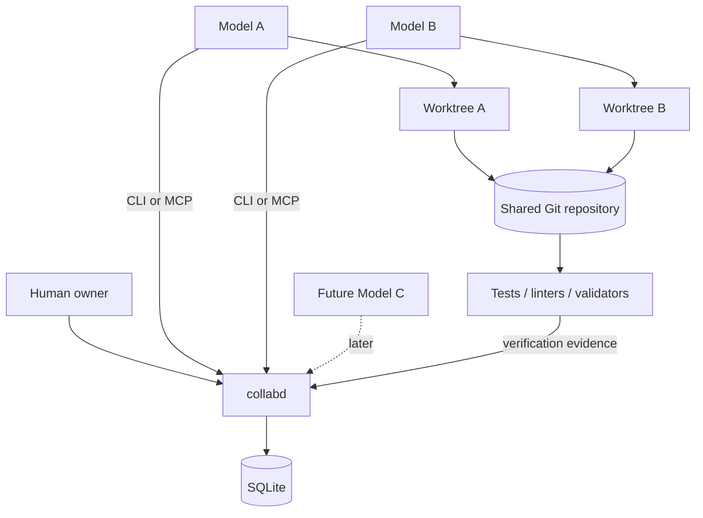
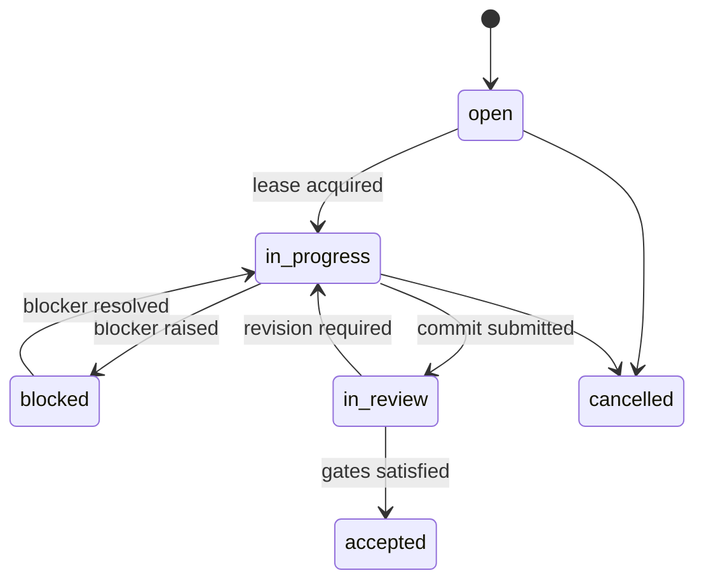
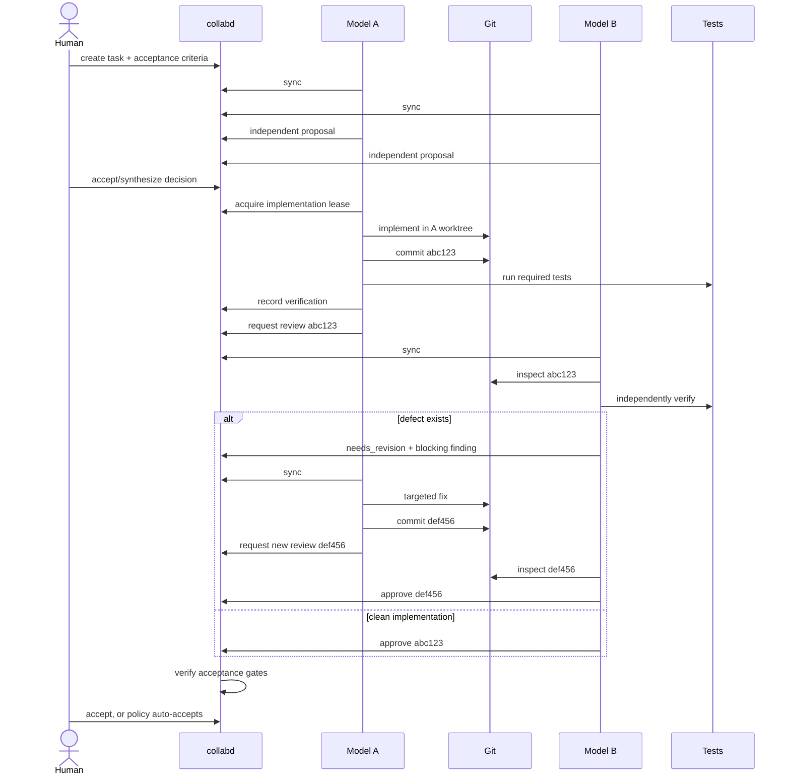

# Two-Agent Local Collaboration Gateway for Frontier Coding Models

## Executive summary

The uploaded handoff defines the concrete research topic: **design and prove a local collaboration gateway that allows two independent frontier coding agents, running in separate terminal sessions, to coordinate on the same real Git repository without turning the gateway into an IDE, a runtime game system, or a universal autonomous-agent framework.** The MMORPG itself remains explicitly out of scope until that collaboration mechanism works. fileciteturn0file0

The strongest architecture is:

> **A small local daemon (`collabd`) owns structured collaboration state in SQLite. A universal CLI (`collab`) is the baseline interface. An MCP endpoint is an optional thin adapter over the same domain service. Git remains the artifact layer, and tests remain the authority on correctness.**

This is preferable to an MCP-only architecture. MCP is now meaningfully cross-vendor: Claude Code, OpenAI Codex, and Gemini CLI all support MCP integrations, making it a useful ergonomic interface. Anthropic documents local and HTTP MCP servers for Claude Code; OpenAI documents MCP integration in Codex; and Google documents MCP server discovery and multiple transports in Gemini CLI. citeturn6view2turn2search3turn6view3 But an ordinary CLI remains the least-common-denominator interface for terminal coding agents and avoids making basic coordination depend on each vendor’s MCP configuration details.

That recommendation has become even stronger because MCP changed substantially just before this report. As of **August 9, 2026**, the latest MCP specification is the **July 28, 2026** release. It moves the HTTP protocol core to a stateless model, removes protocol-level sessions and the old initialization handshake, and encourages application state to be represented explicitly rather than hidden in transport state. citeturn8search0turn7search3 That separation is ideal here: `task_id`, `review_id`, `decision_id`, leases, blockers, and message cursors should be durable application objects in SQLite, while MCP simply exposes operations on them.

Repository safety should be handled with **one linked Git worktree per agent**, attached to one underlying repository, plus an exclusive logical task lease. Git natively supports multiple linked working trees with separate per-worktree state while sharing the common repository. citeturn6view4 Reviews should target immutable Git commit SHAs, and verification results should be recorded against those exact SHAs.

The minimum durable state model should contain **agents, tasks, leases, messages, proposals, decisions, blockers, reviews, review findings, verifications, and an append-only event ledger**. Accepted tasks should require a concrete artifact and objective evidence: an immutable commit, required tests with successful exit status, and no unresolved blocking findings.

SQLite is appropriate for this scale. It supports multiple simultaneous readers and serializes writers; WAL mode allows readers and a writer to operate concurrently on the same machine. citeturn6view5turn6view6 Two or three agents will generate trivial write volume compared with SQLite’s practical capacity, while retaining excellent debuggability and portability.

The first experiment should remain deliberately narrow: **one disposable repository, one nontrivial multi-file task, independent proposals, one implementation owner, one artifact-based reviewer, objective testing, at least one revision cycle, human intervention capability, and a durable history that another person can reconstruct afterward.**

## Scope, assumptions, and research method

### Research questions

The handoff resolves the previously unspecified topic, so the research focuses on the actual engineering problem rather than generic cross-domain possibilities. fileciteturn0file0

| Research question | Recommended answer |
|---|---|
| What should the gateway be? | Local daemon + SQLite + CLI baseline; MCP as adapter |
| How should two terminals communicate? | Structured API operations and explicit synchronization |
| How should repository conflicts be prevented? | Separate Git worktrees plus exclusive task leases |
| How should claims be verified? | Immutable Git refs plus recorded command results |
| How should agent-to-agent communication work? | Short-lived messages, durable decisions/reviews/blockers |
| How should the human remain in control? | First-class human actor with pause, assign, override, reject, waive, accept |
| How should a third model be added? | Add another agent identity/worktree; preserve same gateway |

The core assumption is that modern coding agents already know how to inspect repositories, edit files, run shell commands, use Git, inspect diffs, and run tests. The gateway should therefore **not duplicate those capabilities**. Its job is to provide the state that independent sessions do not naturally share. fileciteturn0file0

A second assumption is that this is initially a **single-machine system**. That makes SQLite and local Git worktrees an especially good fit. SQLite’s WAL implementation relies on shared-memory behavior and is intended for cooperating processes on the same host rather than a network filesystem. citeturn6view6

A third assumption is that the disposable prototype repository can avoid difficult Git edge cases such as heavy submodule usage. Git documents some limitations around multiple worktrees and submodules, so the test repository should remain conventional. citeturn6view4

### Stakeholders and authorities

The architecture becomes much clearer when each component has exactly one kind of authority.

| Actor/component | Authority |
|---|---|
| Human owner | Project intent, final override, pause/reject/accept |
| Agent A/B/C | Engineering proposals, implementation, review |
| `collabd` | Coordination invariants and collaboration state |
| SQLite | Durable coordination records |
| Git | Durable software artifacts |
| Test/lint/type-check tools | Objective executable evidence |

This leads to the following separation:



The daemon coordinates developers. It does not become the developer.

### Research methodology

The research prioritized current primary technical sources because MCP and coding-agent tooling have changed rapidly. Sources included the July 2026 MCP specification release and official SDK material, current Anthropic Claude Code documentation, current OpenAI Codex engineering/product material, Google’s official Gemini CLI repository documentation, Git’s official worktree manual, and SQLite’s official transaction and WAL documentation. citeturn8search0turn6view2turn6view1turn6view3turn6view4turn6view5

The largest remaining empirical uncertainty is not architectural: it is the **exact versions of the two coding-agent binaries installed on the target machine**. MCP interoperability should therefore be smoke-tested against those actual binaries before MCP becomes a required path. The collaboration core should work regardless.

## Current technical landscape and alternatives

### MCP is viable but should remain a transport

MCP is now sufficiently widespread among frontier terminal agents to justify first-class support. Claude Code can connect to locally launched MCP servers and HTTP servers, and Anthropic supports project-scoped configuration. citeturn6view2 Codex includes MCP integrations in its tool system, and OpenAI’s description of Codex core explicitly mentions MCP servers participating in the agent loop. citeturn2search3turn6view1 Gemini CLI discovers MCP tools and documents stdio, SSE, and Streamable HTTP connectivity. citeturn6view3

The July 28, 2026 MCP revision makes an application-layer state model even more appropriate. The new protocol removes the previous HTTP `initialize`/`initialized` handshake and `Mcp-Session-Id`, making each HTTP request independently self-describing. citeturn8search0turn7search3 MCP’s own release material explicitly notes that applications can still maintain state by using explicit handles rather than protocol-hidden session state. citeturn8search0

That maps directly to this harness:

```text
MCP state:
    none required beyond individual tool calls

Collaboration state:
    task IDs
    decision IDs
    review IDs
    leases
    blockers
    message cursors
    agent identities
    Git commit refs
```

MCP therefore should answer the question **“How can an agent invoke collaboration operations?”**

It should not answer **“Where does collaboration truth live?”**

### Comparative gateway analysis

| Architecture | Advantages | Problems | Assessment |
|---|---|---|---|
| Shared Markdown/JSON files | Extremely simple | Weak atomicity, poor querying, easy accidental overwrite | Reject |
| CLI directly mutating SQLite | Minimal processes, universal | Domain rules execute separately in each caller; human watch/control less clean | Good emergency minimum |
| MCP-only server | Excellent agent ergonomics | Makes basic operation dependent on MCP client compatibility/configuration | Too coupled |
| Daemon + CLI | Centralized rules, universal shell access, simple inspection | One extra local process | **Best baseline** |
| Daemon + CLI + MCP | Central rules plus native agent tools | Slight additional adapter work | **Best target** |

A daemon is worth the extra process because it gives one place to enforce invariants. SQLite itself can serialize database writers, but business rules such as “an accepted task cannot contain an unresolved blocking finding” or “a human pause invalidates new lease acquisition” belong in an application service.

### Why not make one frontier agent the coordinator?

OpenAI’s Codex App Server illustrates why agent-harness protocols and collaboration protocols should remain separate. OpenAI describes App Server as a bidirectional JSON-RPC service around Codex core, handling persistent Codex threads, turns, tool execution, progress, approvals, and diffs. citeturn6view1 OpenAI also notes that it initially explored exposing Codex through MCP but found that MCP semantics did not cleanly model every rich IDE-agent interaction, leading to a dedicated App Server protocol. citeturn6view1

That is useful architectural precedent, but the collaboration gateway should not become a Codex App Server equivalent for all models. Doing so would mean building an agent-runtime abstraction layer.

The desired architecture is flatter:

```text
                   collabd
                  /   |   \
                 /    |    \
              Claude Codex Gemini
```

not:

```text
                 Codex coordinator
                  /            \
              Claude          Gemini
```

No frontier model should inherently be the boss merely because its vendor exposes a convenient harness API.

### Recommended implementation stack

A strong reference implementation is **Python + SQLite**, with transport-neutral domain services.

Python is particularly convenient because the core database does not require an external server and the official MCP Python SDK now has a v2 stable line aligned with the 2026-07-28 protocol generation. citeturn9search11

The implementation should still isolate the MCP package:

```text
collab/
    domain/
        tasks.py
        reviews.py
        decisions.py
        leases.py
        verification.py

    storage/
        sqlite.py
        migrations/

    transport/
        cli.py
        http_api.py
        mcp.py

    git/
        worktrees.py
        artifacts.py
```

That means an MCP SDK upgrade affects `transport/mcp.py`, not task semantics.

## Recommended gateway architecture

### The local daemon

`collabd` should be a singleton per collaboration project.

Its responsibilities are:

```text
state validation
task transitions
lease acquisition/release
optimistic version checks
message storage
decision lifecycle
blocker lifecycle
review gates
verification recording
human intervention
event/audit logging
```

Its responsibilities should explicitly **not** include:

```text
source-code editing
running an agent
choosing which code to write
replacing Git
maintaining a giant LLM transcript
general autonomous scheduling
game-specific architecture
```

For local HTTP, the daemon should bind only to loopback. MCP’s security guidance has consistently recommended protecting local HTTP servers from unintended remote access, including loopback binding and origin/authentication controls. citeturn6view0

### Universal CLI

The initial contract should be ordinary commands that any shell-capable coding agent can invoke:

```text
collab sync
collab status

collab task claim TASK-0042
collab task release TASK-0042

collab message send \
    --to model-b \
    --task TASK-0042 \
    "Serializer preserves IDs now; please review."

collab proposal submit TASK-0042 proposal.md
collab decision propose TASK-0042 decision.md

collab blocker add TASK-0042 "Migration test currently fails"
collab blocker resolve BLOCKER-12

collab review request TASK-0042 --commit abc123
collab review submit REVIEW-8 --verdict needs_revision

collab verify TASK-0042 --commit abc123 -- pytest -q

collab complete TASK-0042 --commit abc123
```

The most important operation is `collab sync`.

Rather than forcing an agent to reconstruct state using ten calls, it should return a bounded summary:

```json
{
  "project": {
    "paused": false
  },
  "agent": {
    "id": "model-a"
  },
  "assigned_tasks": [
    {
      "id": "TASK-0042",
      "status": "in_progress",
      "version": 7
    }
  ],
  "messages": [],
  "new_decisions": [],
  "open_blockers": [],
  "review_requests": [],
  "required_actions": []
}
```

Agents should call `sync` at protocol boundaries: session start, before claiming work, before implementation, before commit, after review, and before completion.

### MCP adapter

After the CLI path is proven, the same service methods can be exposed as MCP tools:

```text
collab_sync
collab_claim_task
collab_post_message
collab_submit_proposal
collab_propose_decision
collab_report_blocker
collab_request_review
collab_submit_review
collab_record_verification
collab_complete_task
```

The MCP tool layer should be thin:

```python
@mcp.tool()
def collab_claim_task(...):
    return domain.tasks.claim(...)
```

rather than:

```python
@mcp.tool()
def collab_claim_task(...):
    # hundreds of lines of task policy here
```

That distinction allows the CLI and MCP interface to behave identically.

The current stateless MCP HTTP direction is especially compatible with this structure because durable collaboration state is intentionally external to MCP sessions. citeturn8search0

### Human control

Human intervention must use the same structured system rather than an unofficial escape hatch:

```text
collab watch
collab status --all

collab pause
collab resume

collab assign TASK-0042 model-a
collab lease revoke TASK-0042

collab decision accept DECISION-12
collab decision reject DECISION-12
collab decision supersede DECISION-12 --with DECISION-18

collab blocker waive BLOCKER-7 --reason "accepted design tradeoff"

collab task reject TASK-0042
collab task accept TASK-0042
```

A web dashboard is unnecessary for the first prototype. `collab watch` can provide a live chronological view of the event stream.

Human actions should be durable events:

```text
2026-08-09T18:33:14Z
actor: human
action: lease_revoked
task: TASK-0042
reason: "Stop implementation; architecture direction changed."
```

That ensures an agent restarting five minutes later sees the intervention during `collab sync`.

## Shared state, protocol, and repository safety

### Minimal schema

The following schema is enough to prove the concept without creating Jira.

| Table | Key fields |
|---|---|
| `agents` | `id`, `name`, `kind`, `status`, `last_seen_at` |
| `tasks` | `id`, `goal`, `status`, `owner_agent_id`, `version`, `acceptance_json` |
| `leases` | `task_id`, `agent_id`, `lease_version`, `acquired_at`, `expires_at` |
| `messages` | `id`, `sender`, `recipient`, `task_id`, `body`, `created_at` |
| `proposals` | `id`, `task_id`, `agent_id`, `content`, `status` |
| `decisions` | `id`, `statement`, `rationale`, `status`, `supersedes_id` |
| `blockers` | `id`, `task_id`, `raised_by`, `description`, `status` |
| `reviews` | `id`, `task_id`, `reviewer`, `commit_sha`, `verdict` |
| `review_findings` | `id`, `review_id`, `severity`, `location`, `description`, `status` |
| `verifications` | `id`, `task_id`, `commit_sha`, `command`, `exit_code`, `runner` |
| `events` | `id`, `actor`, `entity_type`, `entity_id`, `action`, `payload`, `timestamp` |

The append-only `events` table is particularly important. It makes the system explainable even when mutable records have moved on.

For example:

```text
task_created
proposal_submitted
proposal_submitted
decision_accepted
lease_acquired
review_requested
review_finding_added
lease_reacquired
review_requested
verification_passed
review_approved
task_accepted
```

That sequence is far more useful than trying to reconstruct the project from two separate model transcripts.

### Optimistic concurrency

Every major mutable entity should have a monotonically increasing `version`.

Suppose Agent A synchronizes:

```text
TASK-0042
version = 7
status = in_progress
```

The human then pauses and reassigns it, producing:

```text
version = 8
```

Agent A later attempts:

```text
complete TASK-0042
expected_version = 7
```

The daemon rejects the stale mutation.

This prevents a delayed agent session from silently overwriting newer collaboration state.

SQLite can provide the database transaction underneath this check. It supports concurrent read transactions from separate processes while allowing one active writer at a time. citeturn6view5

### Task lifecycle

A deliberately small state machine is sufficient:



There is no need yet for epics, sprints, planning graphs, priorities, or dozens of workflow statuses.

### Independent proposals

For consequential architecture questions, the handoff’s proposal pattern should be explicitly supported. fileciteturn0file0

```text
A submits proposal
B submits proposal

neither sees the other

gateway marks both ready

A and B may now read both

critique / synthesis

decision accepted
```

This prevents accidental anchoring.

The database can implement this with:

```text
proposal.visibility = sealed
proposal.visibility = revealed
```

Once a durable decision is accepted, repeated reopening should require either new evidence or a new proposal to supersede it.

### Messaging is not project memory

Messages solve local coordination:

```text
A → B:
I changed the serialization format in abc123.
Please inspect backward compatibility.
```

They should not become durable architectural truth.

When something matters later, promote it:

```text
message
  ↓
review finding / blocker / proposal
  ↓
decision or resolved finding
```

This keeps the shared context small and machine-readable.

### Worktrees instead of one shared directory

A repository can have multiple linked worktrees, letting different branches or detached commits be checked out independently while sharing underlying Git repository data. citeturn6view4

Recommended layout:

```text
mmorpg-project/
    .git/
    .collab/
        collab.db
        config.toml

../worktrees/
    model-a/
    model-b/
```

Terminal A:

```bash
cd ../worktrees/model-a
```

Terminal B:

```bash
cd ../worktrees/model-b
```

Both are working against the same repository history without sharing a mutable filesystem tree.

This is much safer than:

```text
Model A edits src/foo.py
Model B edits src/foo.py
```

in the exact same working directory.

### Task lease versus Git branch

The task lease belongs to the coordination system:

```text
TASK-0042
lease_owner = model-a
```

The implementation branch belongs to Git:

```text
task/TASK-0042
```

These concepts should remain distinct.

A lease says:

> Model A is currently authorized by the collaboration protocol to implement this task.

The branch says:

> These commits are the artifacts associated with the task.

That separation makes recovery easier if an agent crashes, a lease expires, or the human reassigns implementation.

### Reviews must target immutable commits

A review request should look like:

```text
REVIEW-008

task:
TASK-0042

target_commit:
abc123ef...

reviewer:
model-b
```

The reviewer should inspect:

```bash
git show abc123ef
git diff BASE...abc123ef
```

not merely read:

> “I fixed all the issues.”

The reviewer can create a temporary detached worktree if executing the exact reviewed commit is necessary. Git explicitly supports detached linked worktrees for isolated experimentation or testing. citeturn6view4

### Verification records

Tests need first-class records.

```text
VERIFY-019

task:
TASK-0042

commit:
abc123ef

command:
pytest -q

exit_code:
0

runner:
model-b
```

A verification command must always be tied to a commit. Otherwise this race is possible:

```text
tests pass on abc123
agent edits code
task accepted at def456
```

The harness should refuse to treat that test result as evidence for `def456`.

### Acceptance gates

An automated `complete` or `accept` operation should fail when:

```text
candidate commit is missing
required verification is absent
verification is for another SHA
required command exited nonzero
blocking review findings remain open
task blockers remain open
review targets an older commit
project is paused
caller holds stale entity version
```

Human override should remain possible but explicit:

```text
collab blocker waive ...
collab task accept --override --reason "..."
```

The override itself then appears in the audit ledger.

### Full collaboration loop



Nothing more autonomous is required to prove the hypothesis.

## Pilot experiment, metrics, risks, and resources

### Disposable task design

The first development task should exercise multiple engineering skills without introducing game-domain complexity.

A suitable project is a small library implementing a **transactional append-only local event store**.

Required characteristics:

```text
multiple source files
public API
serialization
validation
tests
restart/recovery behavior
one atomicity requirement
```

An acceptance criterion could be:

> A failed batch append must leave no partially committed entries, and reopening the store after a process restart must reconstruct exactly the previously committed state.

This is useful because it gives Model B realistic opportunities to find subtle defects in persistence, atomicity, tests, or API design.

### What the pilot should deliberately exercise

The run should contain:

```text
human task creation
A independent proposal
B independent proposal
decision
A implementation lease
actual code changes
commit
tests
B artifact inspection
B independent tests
blocking review finding
A targeted revision
new commit
B re-review
acceptance
```

A pilot that receives immediate approval without any disagreement is actually a weaker test of the harness.

### Success metrics

| Metric | Required outcome |
|---|---|
| Exclusive ownership | Only one active implementation lease can win |
| Durable recovery | State survives daemon termination/restart |
| Artifact traceability | Every review points to a commit SHA |
| Verification integrity | Every accepted commit has required passing checks against that SHA |
| Review integrity | Blocking findings prevent acceptance |
| Revision integrity | Changing the candidate SHA forces re-review |
| Human authority | Human pause/revoke overrides stale agent operations |
| Coordination recovery | A restarted agent can reconstruct its obligations from `sync` |
| Audit completeness | Full task history can be understood without either model transcript |
| Independent reasoning | A/B initial proposals can remain sealed until both exist |

A particularly valuable concurrency test is:

```text
A calls claim TASK-0042
B calls claim TASK-0042
```

at nearly the same instant.

Exactly one should succeed.

A particularly valuable recovery test is:

```text
A requests review
kill collabd
restart collabd
restart B terminal
B runs collab sync
```

B should see the review request and exact commit without human reconstruction.

### Risks and uncertainties

**Protocol noncompliance by agents.** A sufficiently privileged agent could ignore a task lease and modify arbitrary files. Worktrees reduce accidental interference but do not create a security sandbox. Hard OS-level enforcement can be considered later if actual violations occur.

**MCP client freshness.** The July 28, 2026 specification is only days old as of this report and includes significant breaking HTTP-lifecycle changes. citeturn8search0 The MCP adapter should therefore support whatever compatibility mode the selected official SDK and actual installed clients can negotiate. Basic project success must not require the newest wire revision.

**Schema creep.** The largest product risk is building a generalized project-management framework instead of the minimum collaboration mechanism. New fields or entities should require evidence from the pilot.

**Conversational memory creep.** If agents begin putting durable architectural facts only into messages, the value of structured state disappears. Agent instructions should explicitly tell them when to promote a message to a blocker, decision, or review finding.

**Ceremonial review.** Require immutable commit targets and objective review evidence so “looks good” does not become a substitute for inspecting code.

**SQLite scaling.** This is not a practical concern for the intended initial workload. SQLite permits multiple readers and serializes writers, and WAL supports simultaneous readers and a writer on one machine. citeturn6view5turn6view6 Reconsider the database only if the system becomes a networked, multi-host service.

**Git worktree edge cases.** Git itself describes some multi-worktree/submodule limitations. citeturn6view4 The prototype should avoid submodules, and worktree lifecycle should be wrapped by simple helper commands rather than manipulated manually by every agent.

### Implementation effort

A reasonable planning estimate for a disciplined prototype is approximately **one to two dozen focused engineering hours**, including tests and the actual two-agent experiment.

The work can be divided roughly as follows:

```mermaid
gantt
    title Prototype engineering sequence
    dateFormat X
    axisFormat %s

    section Core
    SQLite schema and migrations        :a1, 0, 3
    Domain state transitions            :a2, after a1, 3
    Versioning and audit ledger         :a3, after a2, 2

    section Interfaces
    CLI commands and sync               :b1, after a2, 3
    Human watch/control                 :b2, after b1, 2

    section Git
    Worktree bootstrap                  :c1, after a1, 2
    Commit and verification plumbing    :c2, after c1, 2

    section Integration
    CLI-only two-agent pilot            :d1, after b2, 3
    MCP adapter                         :d2, after d1, 3
    Cross-client smoke tests            :d3, after d2, 2
```



The required infrastructure is intentionally small: Git, SQLite, one small programming-language runtime, the two chosen coding-agent CLIs, and the test tooling for the disposable repository.

The official MCP ecosystem also provides an Inspector for testing MCP servers independently of any one agent client, making it useful once the adapter is implemented. citeturn7search1

### Recommended implementation order

The highest-value sequence is:

**Build the state machine first.** Tasks, leases, versions, messages, decisions, reviews, verification, blockers, and events.

**Build the CLI second.** This proves the collaboration semantics without introducing MCP compatibility as another variable.

**Add worktree bootstrapping.** Each model gets its own working directory against the same repository.

**Run failure tests.** Concurrent claims, stale updates, daemon restart, wrong-SHA verification, unresolved blocker, post-review edits, and human pause/revoke.

**Run the full CLI-only two-model experiment.**

**Add MCP as a thin adapter.**

**Repeat the same experiment using MCP wherever each selected coding agent supports it cleanly.**

Only after those steps should the gateway point at the real MMORPG repository.

## Prioritized sources and final recommendation

The most important current source is the **July 28, 2026 MCP specification release**, because it materially changes the architectural implications of MCP. The protocol’s HTTP core is now stateless, the old initialization/session mechanism has been removed, and explicit application state is preferred. citeturn8search0turn7search3

Next in priority are the actual coding-agent integration documents. Anthropic documents MCP integration in Claude Code. citeturn6view2 OpenAI documents MCP integrations in Codex and provides a useful reference architecture for keeping an agent harness behind structured JSON-RPC rather than equating it with terminal output. citeturn2search3turn6view1 Google documents MCP integration in Gemini CLI, supporting the premise that a third model family can later use the same gateway. citeturn6view3

Git’s official worktree documentation provides the right repository-isolation primitive. citeturn6view4 SQLite’s transaction and WAL documentation supports the proposed durable coordination store for a few cooperating local processes. citeturn6view5turn6view6 The current MCP Python SDK documentation provides a practical implementation path for an MCP adapter once the transport-independent collaboration core exists. citeturn9search11

The resulting design should therefore be treated as the baseline architecture:

```text
                         HUMAN
                           │
             pause / assign / override
                           │
                           ▼
                 ┌──────────────────┐
                 │     collabd      │
                 │                  │
                 │ domain rules     │
                 │ task state       │
                 │ review gates     │
                 │ lease rules      │
                 └───────┬──────────┘
                         │
                  ┌──────┴──────┐
                  │             │
                CLI API       MCP API
                  │             │
             ┌────┘             └────┐
             ▼                       ▼
          Model A                  Model B
             │                       │
             ▼                       ▼
       worktree/model-a       worktree/model-b
             \                       /
              \                     /
               └──── shared Git ───┘
                        │
                        ▼
                 tests / validators

                      collabd
                         │
                         ▼
                       SQLite
              tasks / messages / leases
              decisions / reviews
              blockers / verification
                    audit events
```

The governing principles are straightforward:

**The repository is the artifact.**

**SQLite is collaboration memory, not source-code storage.**

**The daemon enforces coordination invariants.**

**The CLI is the universal interface.**

**MCP is an adapter, not the source of truth.**

**Task ownership is explicit and temporary.**

**Separate Git worktrees prevent accidental filesystem collisions.**

**Reviews refer to immutable commits.**

**Tests and validators produce recorded evidence.**

**Messages are transient; decisions and findings are structured and durable.**

**The human is a first-class authority, not an exceptional interruption.**

**A third model should be an additional participant, not an architectural rewrite.**

Most importantly, the next milestone is **not an MMORPG system** and not a general-purpose multi-agent platform. It is one successful, inspectable engineering loop in which two genuinely independent coding agents share a real repository, disagree intelligently, coordinate through structured state, inspect one another’s actual work, catch and correct a defect, pass objective verification, and leave behind a collaboration history that remains understandable after both model sessions are gone. fileciteturn0file0